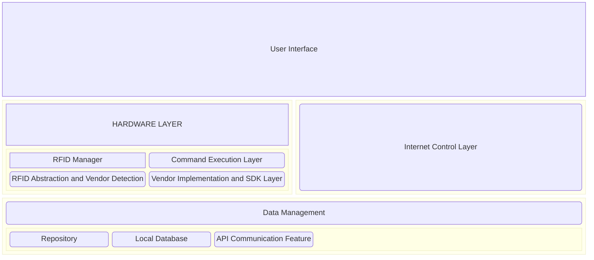

# [TECH-397] RFID Reader

Proyecto de Materia Integradora que busca desarrollar una solución para el control eficiente del
stock de inventario, así también como agilizar procesos como la contabilización del stock físico
disponible.

## Capas de la Aplicación

